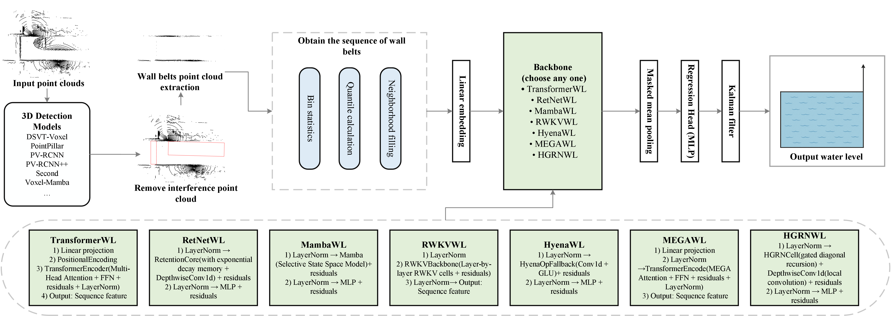

# Water Level Monitoring in Ship Locks 🚢

This repository provides the code and models for **non-contact water level monitoring in confined lock chambers** using LiDAR point clouds and deep temporal regression.  
It is based on our research on centimeter-level water level estimation in the Shiqiao Ship Lock using the TROUT multimodal dataset. 

**Highlights**: 
* The code has been published, (Sep. 2025)
* The code supports one-click operation.


## Overview
- [Changelog](#changelog)
- [Model Zoo](#model-zoo)
- [Installation](#installation)
- [Getting Started](#GETTING-STARTED)
- [Citation](#citation)


## Changelog
[2025-09-26] `Water-level-monitoring` v0.1.0 is released. 


## Introduction
This project provides a unified deep learning framework for non-contact water level monitoring in ship locks using LiDAR point clouds and temporal regression models.


Main contributions:
- ✅ **Wall-band point cloud extraction**: Removes ships and lock gates with 3D detection and constructs water-band sequences along chamber walls. 
- ✅ **Deep temporal regression**: Supports multiple backbone models (Transformer, RetNet, Mamba, RWKV, Hyena, MEGA, HGRN). 
- ✅ **Spatial-temporal filtering**: Combines bounding-box–based point removal and online Kalman filtering for robust estimation. 
- ✅ **Evaluation pipeline**: Centimeter-level MAE and RMSE on real-world TROUT dataset. 


- DATA at：[PCDet_TROUT_data](https://drive.google.com/file/d/1JCClYd6egTm0AxXtW80L18AySgG45_og/view?usp=sharing).


<p align="center">
  
</p>


## Model Zoo

### Water Level Monitoring in Ship Locks Baselines
* All models are trained with GTX 4080 GPU and are available for download. 

|                                             |  MAE(cm) | RMSE(cm)  | Bias(cm) | Corr  |
|---------------------------------------------|:-------:|:---------:|:-------:|:-------:|
| wl_hrgn | 1.77 | 2.27| 0.08 | 0.9698 |
| wl_hyena | 2.37 | 3.09 | 0.06 | 0.9452 |
| wl_mamba | 1.93 | 2.49 | -0.01 | 0.9638 |
| wl_mega | 2.64 | 3.47 | 0.21 | 0.9297 |
| wl_retnet | 2.34 | 3.04 | -0.14 | 0.9468 |
| wl_hyena | 2.08 | 2.72 | -0.21 | 0.9568 |
| wl_hyena | 1.98 | 2.57 | -0.19 | 0.9652 |

## Installation


If you want to implement 3D detection on your own computer and obtain the final detection result, you need to install the PCDet_trout environment. Please refer to the [PCDet_trout_github](https://github.com/serendipitylxd/Hydro3DNet) installation method.
Of course, we have also provided ready-made 3D detection results in the outputs/det3d file,so you don't have to install the pcdet environment.

1. Create a new conda environment (recommended):

```bash
conda create -n trout python=3.8
conda activate trout
```

2. Install PyTorch with CUDA 11.8 (make sure your CUDA version matches):

```bash
pip install torch==2.1.0 torchvision==0.16.0 torchaudio==2.1.0 --index-url https://download.pytorch.org/whl/cu118
```

3. Install the remaining dependencies:

```bash
pip install -r requirements.txt
```

## Getting Started

The checkpoint of the 3D model needs to be downloaded and placed in the corresponding path

[dsvt_voxel_trout_99M](https://drive.google.com/file/d/1ogt1wMTLQ1vDvJhzAiHGpQztLJH6wF_9/view?usp=sharing)

[pointpillar_trout_58M](https://drive.google.com/file/d/18jLmXM-chjmL1iEtMOzgqvEXxqhz-Hee/view?usp=sharing) 

[pv_rcnn_trout_158M](https://drive.google.com/file/d/11ld6ZocQq39RsFXT_AO4-qH0Qg38XDxd/view?usp=sharing)

[pv_rcnn_plusplus_trout_169M](https://drive.google.com/file/d/1kCMnxVuFaLpKpMWynIiBbFY7-WKGXwyY/view?usp=sharing)

[second_trout_58M](https://drive.google.com/file/d/1jsgBfjvD0Aa7_ywrZR7-zrOrc_WK_Yjz/view?usp=sharing)

[voxel_mamba_trout_142M](https://drive.google.com/file/d/1j6-VIsT_YAJLACLVLMxmxSK5cilgEnfV/view?usp=sharing)
```
No-stop-lines
├── pcdet_models
│   ├── checkpoint
│   │   │── dsvt_voxel.pth
│   │   │── convnext.pth
│   │   │── pv_rcnn.pth
│   │   │── pv_rcnn_plusplus.pth
│   │   │── second.pth
│   │   │── voxel_mamba.pth
```

### How to use TROUT data sets for training and evaluation

### How to use TROUT datasets for training and evaluation

1. **Prepare dataset folders**

Before running, you need to download [PCDet_TROUT_data](https://drive.google.com/file/d/1JCClYd6egTm0AxXtW80L18AySgG45_og/view?usp=sharing) first, and then update the relevant paths of 'configs/infer_3d_pcdet.yaml' and 'configs/wl_xxx.yaml'.

2. 3D detection results (optional)

If you already have precomputed fused JSONs, place them in the dataset root (e.g. fused.det3d.json) and set the path in your config.

If you want to run OpenPCDet inference to generate 3D detection results, use:

```shell
python scripts/infer_3d_pcdet.py --cfg configs/infer_3d_pcdet.yaml
```
This will produce *.det3d.json per model and a fused result.

3. **Train a model**

Example (Transformer backbone):

```shell
python scripts/train_wl.py --cfg configs/wl_transformer.yaml
```

The model checkpoint and validation metrics will be saved in outputs/<model_name>/.

4. Evaluate a model

Example:

```shell
python scripts/eval_wl.py --cfg configs/wl_transformer.yaml
```

This will generate:

predictions.csv with per-frame ground truth and predictions

eval_results(test_dataset).txt with MAE, RMSE, Bias, Corr

## License
`Water-level-monitoring` is released under the [Apache 2.0 license](LICENSE).

## Acknowledgement

We hope that this repo will serve as a powerful and flexible code base that will benefit the research community by accelerating the process of re-implementing previous work and/or developing new methods.

## Citation
If you find this project useful in your research, please consider cite:


```
@misc{no-stop-line2025,
    title={A Unified Deep Temporal Framework for Water Level Monitoring Using Wall-Belt Point Clouds},
    author={Xiaodong Lu},
    howpublished = {\url{https://github.com/serendipitylxd/No-stop-lines}},
    year={2025}
}
```

## Contribution
Welcome to be a member of the `TROUT` development team by contributing to this repo, and feel free to contact us for any potential contributions. 


